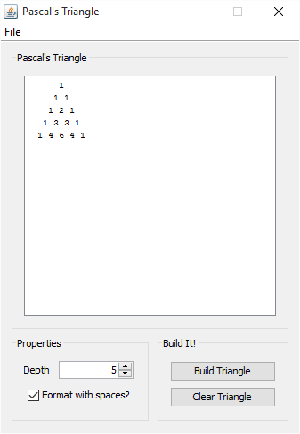
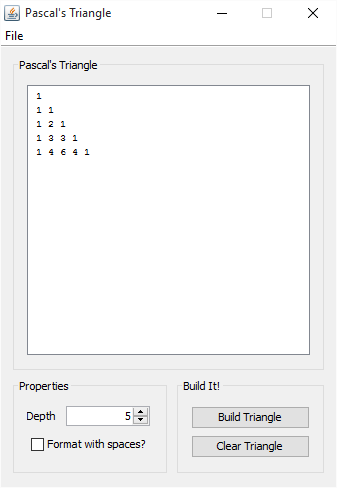

# PascalTriangle
A simple GUI implementation of Pascal's Triangle.

### How to Run
Download the .jar file from [here](https://github.com/OliverAbdulrahim/PascalTriangle/blob/master/dist/PascalTriangle.jar?raw=true) and run the file (you'll need Java 8 or later for it to work). Or, if you prefer to run from the console, type:
```
java -jar "<location of PascalTriangle.jar>"
```

# About
A simple GUI implementation of the mathematical set, [Pascal's Triangle](https://en.wikipedia.org/wiki/Pascal's_triangle).

### Preview
Here are some images of the user interface.  


Default triangle with padded spacing.  



Default triangle without padded spacing.  
